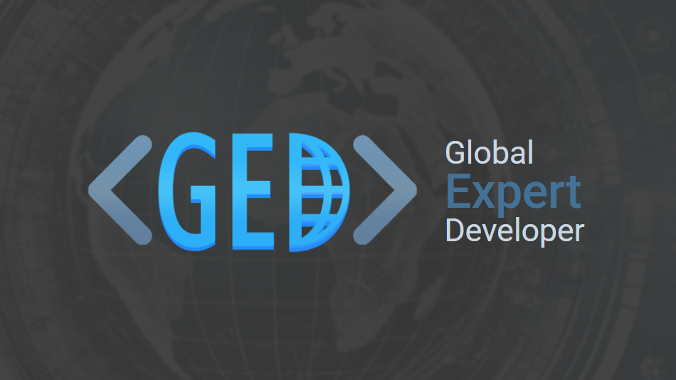

# Global Expert Developer

**Global Expert Developer** is a program dedicated to recognizing exceptional developers from around the globe. We celebrate developers who have demonstrated outstanding skills and contributions through their work in software development, open-source projects, and technological innovation. The program is based solely on merit, evaluating developers on their body of work, without regard for connections or country of origin.

## Key Features

### No Referral Required – No Gatekeeping

We believe that great work should speak for itself. At **Global Expert Developer**, there is no need for insider referrals or connections to apply. The program is open to everyone, and developers are evaluated solely on the merit of their work, achievements, and impact within the tech community. By removing unnecessary barriers, we ensure a fair and transparent evaluation process that empowers developers from diverse backgrounds to be recognized for their excellence.

### No Public Speaking Required

Being a great developer is about producing excellent work, not public speaking. At **Global Expert Developer**, there is no requirement for applicants to be speakers at conferences or workshops. Our acceptance criteria are not influenced by potential financial gain or visibility, focusing instead on the tangible contributions developers have made to the field.

## How It Works

The application process is open to anyone. Developers can submit their projects, code, and contributions for evaluation. A team of expert reviewers assesses each submission based on key criteria, including the quality of work, innovation, and relevance to the broader developer ecosystem.

## [Apply Now](https://www.globalexpert.dev/apply "Apply Now")

Successful applicants earn the prestigious title of **Global Expert Developer**, gaining access to a thriving international network of peers and professional growth opportunities.

## Get Involved

Join us in recognizing and celebrating the world's top developer talent! Whether through applying, contributing to open-source, or being part of our community, we welcome developers from all backgrounds and skill levels.
